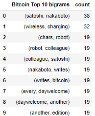
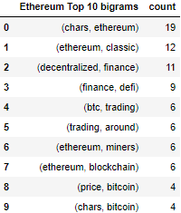
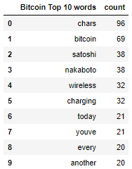
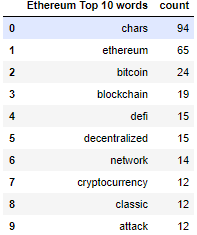
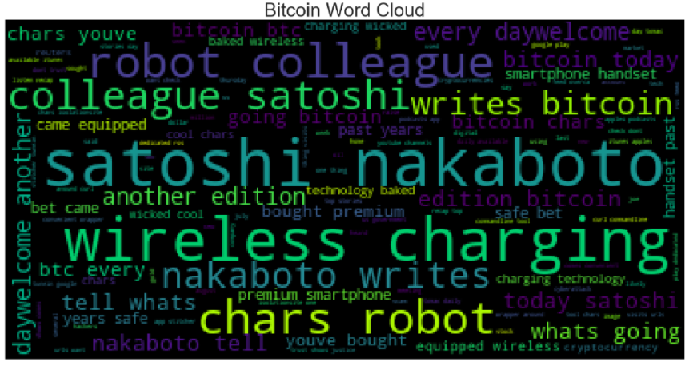
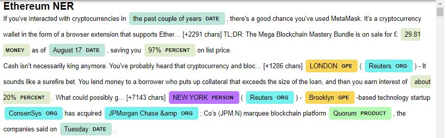

# Tales from the Crypto

## Background

There's been a lot of hype in the news lately about cryptocurrency, so I wanted to take stock of the latest news headlines regarding Bitcoin and Ethereum to get a better feel for the current public sentiment around each coin.

Here I have applied natural language processing to understand the sentiment in the latest news articles featuring Bitcoin and Ethereum. I have  also applied fundamental NLP techniques to better understand, other factors involved with the coin prices such as common words and phrases and organizations and entities mentioned in the articles.

Following tasks are completed:

1. [Sentiment Analysis](#1---Sentiment-Analysis)
2. [Natural Language Processing](#2---Natural-Language-Processing)
3. [Named Entity Recognition](#3---Named-Entity-Recognition)

---

## Files

[Jupyter Notebook](Starter_Code/crypto_sentiment.ipynb)

----

### 1 - Sentiment Analysis

I have used the [newsapi](https://newsapi.org/) to pull the latest news articles for Bitcoin and Ethereum and create a DataFrame of sentiment scores for each coin. I have taken all the English news on each coin because volume of news articles in 2020 and 2019 was only 1 and there were no news article for Canada. 

Following questions were answered using descriptive statistics:

<b> Which coin had the highest mean positive score? </b> 
 
    Bitcoin mean positive score is 0.086247 which is higher than that of Ethereum which is 0.068096

<b> Which coin had the highest negative score? </b> 

    Ethereum's max negative score is slightly higher than Bitcoin's.

<b>Which coin had the highest compound score? </b>

    Ethereum max compund score is 0.851900 which is better than that of Bitcoin.

<b> Which coin had the highest positive score? </b>

    Ethereum's max positive score is higher than that of Bitcoin's.  

---

### 2 - Natural Language Processing

Here I used NLTK and Python to tokenize text, find n-gram counts, and create word clouds for both coins. 

#### Tokenize

I have ensured to:

1. Lowercase each word
2. Remove punctuation
3. Remove stop words

#### N-grams

Next, looked at the ngrams and word frequency for each coin.

1. Used NLTK to produce the ngrams for N = 2.
2. Listed the top 10 words for each coin.

Following questions were answered:

<b> Top 10 bigrams for each coin are: 

 

<b> Top 10 words for each coin are: 

 

#### Word Clouds

Lastly, generated word clouds for each coin to summarize the news for each coin.

---

### 3 - Named Entity Recognition

Finally, I built a named entity recognition model for both coins and visualize the tags using SpaCy. Below are the samples of the NERs. For complete tags, please refer to the Jupyter Notebook to scroll till the end.

---

## Resources

[Vader Sentiment Analysis](http://www.nltk.org/howto/sentiment.html)

---
